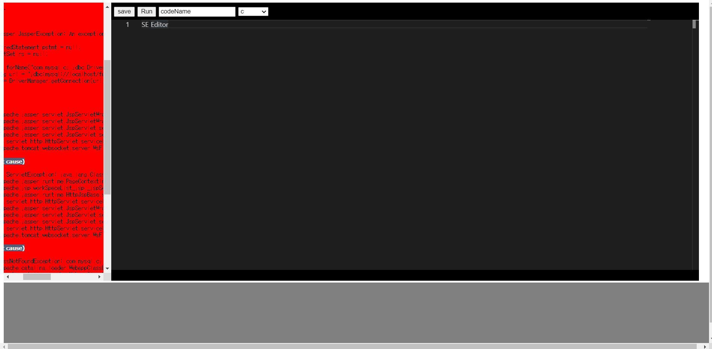
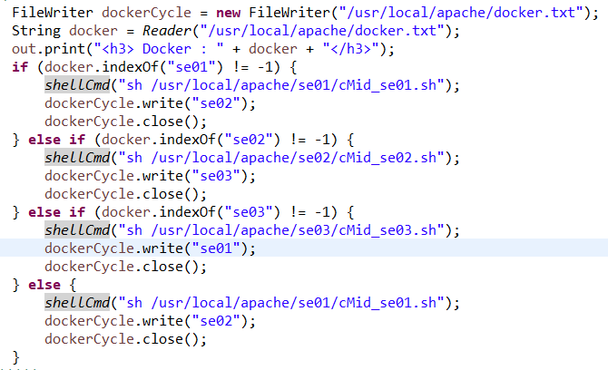
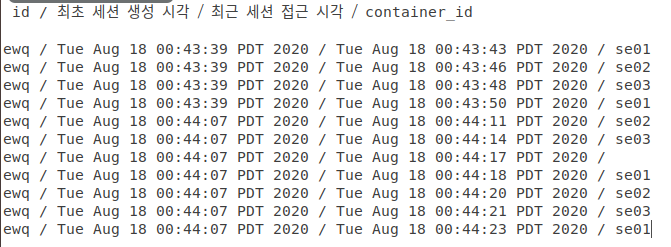

# WebCompiler_SE.LAB
Se.LAB 학생들의 코딩 연습을 위한 웹 컴파일러 제작!

- 개발환경
    - JAVA : JDK-14.0.2
    - OS : ubuntu-18.04.4
    - JSP
    - Tomcat 9

- 컴파일러 & 인터프린터 설치
    - JAVA : JDK-14.0.2
    - Python : 2.7.17
    - c : gcc (Ubuntu 7.5.0-3ubuntu1~18.04) 7.5.0
    - js : nodeJS v8.10.0

### [Front 기본](https://github.com/DongGeon0908/WebCompiler_SE.LAB/blob/master/Front.md)

### Compiler 기본 
1. 서버[리눅스]에서 웹을 배포하여 외부에서 텍스트 입력시 리눅스 컴파일러를 이용하여 해당 텍스트 컴파일
    - ! 리눅스 환경에서 한글화가 되어야함
    -C-
    - gcc와 g++ 중에서 어떤것을 택할지?
        1) gcc : c, c++ 둘다 컴파일
        2) g++ : c++에 특화됨 -> c++ 컴파일시 매끄럽게 진행됨
        결론) g++ 선택
    - java에서 리눅스로 명령을 보내면 부등호는 인식을 하지못함?
        1) gcc -o test test.c 2> error.txt 할경우 실행자체가 불가능
            - 리눅스 안에 gcc -o test test.c > result.txt 2> error.txt를 실핼할 수 있는 c파일 만들기
                1) gedit cInstead.c -> ./cInstead 를 거쳐서 컴파일 진행
            - 모든 쉘 명령어를 리눅스에 c파일로 구현, 자바코드의 필요성 낮춤
            - tomcat의 위치가 관리자 권한이 있어야 접근 가능
                1) 리눅스에 명령해야 하는 모든 파일들을 chmod 777로 설정
                2) error 코드는 저장됨 그러나 result 코드는 저장 불가
                3) 결론적으로 이전의 코드도 관리자 권한을 고려하지 않았으므로 틀린 코드 <stong>재수정 필요</strong>

        2) 위의 권한 문제가 해결해야 하는 문제이지만, 현재 개발단계에서 고려할 사항이 아님, 지금까지 해결하지 못했던 이유는 로그를 찍지 못했던것 같음
            - 모든 주요 코드 하단에 로그를 찍을 수 있는 메서드 추가
            - 로그를 확인한 결과 for문에서 오류를 발견
                1) for문을 삭제하고 다른 방법을 찾기
                2) for문에 들어가는 ArrayList를 한번만 호출할 수 있게 조절

        결론) 먼저 c파일을 생성하여 자바가 해석하지 못하는 문구를 대신 해석한다.
              기존에 자바에서 명령했던 문구를 [실행파일](https://github.com/DongGeon0908/WebCompiler_SE.LAB/blob/master/linux/src/cMid.c)로 만들어서 재해석 시킴

    -JAVA-
    - gcc로 c Compiler를 구현한 내용을 바탕으로 JAVA COMPILER 구현
    - gcc와 다른점
        1) 컴파일 구조가 다르다.
            - JAVAC로 .java 파일을 컴파일 할경우 class명으로 .class 파일 생성
            - 생성된 .class 파일을 실행하기 위해서 java class명 명령 필요

        결론) C Compiler를 제작했던 것 처럼 자바가 해석하지 못하는 문구를 대신 해석
                자바가 <hr> 부등호를 해석하지 못함 기존에 자바에서 명령했던 문구를 [실행파일]()로 만들어서 재해석 시킴
        2) 자바 컴파일 한글 패치
```
docker exec se03 sh -c "cd compile; javac -encoding utf-8 javaTest.java 2> javaError.txt"
docker exec se03 sh -c "cd compile; java -Dfile.encoding=utf-8 SELAB > javaResult.txt"
```
    
    -PYTHON-
    - python은 인터프린터 언어로 컴파일 과정을 거치지 않느다. 그점에서 위의 JAVA와 C Compiler와 상호 다른 부분이 존재했다.
        1) 실행 결과 python python.py를 실행하면 즉각적으로 결과가 출력됨
            - 오류출력은? 어떻게?
                1) 표준 에러 출력을 pythonError.txt파일에 입력시킨다. 
                2) pythonError.txt 파일에 데이터가 입력된 상태이면 실행이 성공한 것으로 생각하고 결과값을 유도받는다.
            - 오류출력에 문제점이 발생할 경우 또는 .py 파일의 데이터가 쌓이는 겨우
                1) 제일 먼저 실행될 리눅스 명령문을 .py 파일과 pythonError.txt파일을 지우도록 했다.
                2) 기존 데이터를 지움으로써 이후에 입력될 내용들의 오류를 잡는다.
        2) python 한글 패치
            - `# -*- coding: utf-8 -*-`

     -JS-
     - JS는 python과 같은 인터프린터 언어이다. 자바와 c언어처럼 별도의 컴파일 과정을 거치지 않는다. 그러므로 이를 해결하기 위해서 python과 같은 구조로 해석문 구조를 구현했다.
        1) 실행 결과 js hello.js를 실행하면 즉각적으로 결과가 출력됨
            - 오류출력은? 어떻게?
                1) 표준 에러 출력을 jsError.txt파일에 입력시킨다.
                2) jsError.txt 파일에 데이터가 입력된 상태이면 실행이 성공한 것으로 생각하고 결과값을 유도 받는다.
            - 오류출력에 문제점이 발생할 경우 또는 .js 파일의 데이터가 쌓이는 경우
                1) 제일 먼저 실행될 리눅스 명령문을 .js 파일과 js.txt파일을 지우도록 함
                2) 기존 데이터를 지움으로써 이후에 입력될 내용들의 오류를 잡음   


2. 기존에 구현한 FORM에 컴파일 기능을 추가
    - 기존 FORM은 IFRAME을 사용
    - 모로코 에디터 사용
        1) 모로코 에디터에 데이터 사입
        2) 삽입된 데이터는 서블릿을 통해 리눅스에서 컴파일 실행
        3) 실행된 내용은 IFRAME을 통해 FORM으로 데이터 출력
    

 - 이미지 



- SQL 
    - [SQL 작성 패치전](https://github.com/DongGeon0908/WebCompiler_SE.LAB/blob/master/sql/seEditorDB_KOR%ED%8C%A8%EC%B9%98%EC%A0%84.sql)
    - mysql 연동시 오류 발생?

        결론) (java-mysql)에 있는 mysql-connector-java-5.1.45.jar -> tomcat -> lib로 이동 
    - DataBase ID : SELAB
    - DataBase PW : 1234

    - 코드 저장이 되지 않음?
        1) mysql에서 추가한 회원으로 데이터를 삽입후 진행시 코드 저장 불가
        2) Front에서 가입한 회원으로 데이터 삽입시 코드 저장 가능

        결과) 웹에서 가입을 진행한 회원 ID로만 회원가입이 가능함!!
        
### Docker를 통하여 컴파일러에 대한 안정성 확보
- Docker 설치파일
    + jdk 14.0.2
    + gcc
    + python3
    + nodejs
- Docker 내부 apt 설치 방법
    + Docker 내부에 `apt update` 실행
    + java
        * 공유폴더에 해당 jdk 압축파일 저장
        * Docker 내부에 `tar zxvf jdk-14.0.2.tar.gz` 실행
        * Docker 내부에 `sudo mkdir /usr/lib/jvm` 실행
        * Docker 내부에 `sudo mv jdk-14.0.2 /usr/lib/jvm` 실행
        * Docker 내부에 `update-alternatives --install /usr/bin/java java /usr/lib/jvm/jdk-14.0.2/bin/java 1` 실행
        * Docker 내부에 `update-alternatives --install /usr/bin/javac javac /usr/lib/jvm/jdk-14.0.2/bin/javac 1` 실행
        * Docker 내부에 `update-alternatives --config java` 실행
        * Docker 내부에 `update-alternatives --config javac` 실행
    + python
        * Docker 내부에 `apt install python3` 실행
    + js
        * Docker 내부에 `apt install nodejs` 실행
    + c++, c
        * Docker 내부에 `apt install gcc` 실행

- 도커의 컨테이너에서 클라이언트가 보낸 소스를 컴파일
    + 컴파일된 결과를 메인 리눅스로 공유

```
    docker run -it --name se01 -v /root/data:/data ubuntu
    docker run -it --name se02 -v /root/data:/data ubuntu
    docker run -it --name se03 -v /root/data:/data ubuntu
```
- cd를 실핼할 수 없다 -> cmd가 다르기 때문
    + 쉘스크립트를 사용해서 해결하자
        * 도커에 직접 명령을 주기
            - sudo docker exec 컨테이너이름 sh -c "명령문; 명령문; 명령문"
        * 해당 폴더를 공유할 경우 문제점이 발생
            - 컨테이너의 공유폴더에 소스 복사 -> 컨테이너는 해당 소스를 자신의 다른 폴더로 복사 -> 컴파일된 결과를 공유폴더로 이동
            - 수정 필요함
        * cd는 작동하지 않음 but 절대경로명 파일 찾기는 가능!!!
- 기존 webapps에서 컴파일을 진행할때 보다 현저히 속도가 저하됨 
    + 해결방법 찾아야함!

1) docker cotainer 내부에서 c 컴파일

```
"/usr/local/apache/share/cResult.txt"
```

* 쉘 스크립트를 이용하여 도커 진입하기 (cMid.sh) -> 기본 버전
            
```
#!bin/bash

docker restart se01
docker exec se01 sh -c "cd data; cp cTest.txt cTest.c; gcc -o cTest cTest.c 2> cError.txt;"


docker restart se01
docker exec se01 sh -c "cd data; ./cTest > cResult.txt;"
```

* 쉘 스크립트를 이용하여 도커 진입 후 내부 폴더에서 컴파일 진행 (cMid.sh) -> 수정 버전
```
#!bin/bash

docker restart se01

docker exec se01 sh -c "cd compile; rm -r cTest;"
docker exec se01 sh -c "cd compile; rm -r cError.txt;"
docker exec se01 sh -c "cd compile; rm -r cResult.txt;"

docker exec se01 sh -c "cd data; mv cTest.txt ../compile"
docker exec se01 sh -c "cd compile; cp cTest.txt cTest.c"
docker exec se01 sh -c "cd compile; gcc -o cTest cTest.c 2> cError.txt"
docker exec se01 sh -c "cd compile; ./cTest > cResult.txt"
docker exec se01 sh -c "cd compile; mv cResult.txt ../data"
docker exec se01 sh -c "cd compile; mv cError.txt ../data "
```


* 절대경로와 [쉘스크립트](https://github.com/DongGeon0908/WebCompiler_SE.LAB/tree/master/linux/sh)를 이용하여 도커 진입과 표준출력 및 에러출력을 프론트로 전송!! 성공~~ 
    + cMid.c => cMid.sh로 효율성을 높임

2) 도커내부에서 python 컴파일
```
#!bin/bash

docker restart se01

docker exec se01 sh -c "cd compile; rm -r pythonTest.py;"
docker exec se01 sh -c "cd compile; rm -r pythonError.txt;"
docker exec se01 sh -c "cd compile; rm -r pythonResult.txt;"

docker exec se01 sh -c "cd data; mv pythonTest.txt ../compile"
docker exec se01 sh -c "cd compile; cp pythonTest.txt pythonTest.py"
docker exec se01 sh -c "cd compile; python pythonTest.py > pythonResult.txt 2> pythonError.txt"
docker exec se01 sh -c "cd compile; mv pythonResult.txt ../data"
docker exec se01 sh -c "cd compile; mv pythonError.txt ../data "

```
- 기존의 코드에서 문제점은 코드의 재사용성이 없었으며, 코드의 불안정성이 존재했음
    + 쉘스크립트를 통해서 코드의 재사용성과 controller의 안정성을 높임
    + python a.py 를 통해 코드를 해석

3) 도커내부에서 js 컴파일
```
#!bin/bash

docker restart se01

docker exec se01 sh -c "cd compile; rm -r javascriptTest.js;"
docker exec se01 sh -c "cd compile; rm -r javascriptError.txt;"
docker exec se01 sh -c "cd compile; rm -r javascriptResult.txt;"

docker exec se01 sh -c "cd data; mv javascriptTest.txt ../compile"
docker exec se01 sh -c "cd compile; cp javascriptTest.txt javascriptTest.js"
docker exec se01 sh -c "cd compile; node javascriptTest.js > javascriptResult.txt 2> javascriptError.txt"
docker exec se01 sh -c "cd compile; mv javascriptResult.txt ../data"
docker exec se01 sh -c "cd compile; mv javascriptError.txt ../data "
```
- 자바스크립트는 기존의 파이썬 인터프린터와 비슷하기 때문에 간단하게 구현 가능
    + node a.js 를 통해 코드를 해석

- 도커 내부에 설치되는 프로그램
    + apt update
    + apt install gcc
    + apt install gedit
    + apt-get install -y nodejs
    + apt install python

4) 도커내부에서 java 컴파일
```
#!bin/bash

docker restart se01

docker exec se01 sh -c "cd compile; rm -r SELAB.class;"
docker exec se01 sh -c "cd compile; rm -r javaError.txt;"
docker exec se01 sh -c "cd compile; rm -r javaResult.txt;"

docker exec se01 sh -c "cd data; mv javaTest.txt ../compile"
docker exec se01 sh -c "cd compile; cp javaTest.txt javaTest.java"
docker exec se01 sh -c "cd compile; javac javaTest.java 2> javaError.txt"
docker exec se01 sh -c "cd compile; java SELAB > javaResult.txt"
docker exec se01 sh -c "cd compile; mv javaResult.txt ../data"
docker exec se01 sh -c "cd compile; mv javaError.txt ../data "
```
- class명은 SELAB으로 고정!


- 다수의 클라이언트를 도커의 컨테이너로 분배하는 방법
    + 순차분배를 통한 도커의 부담 줄이기
        * `cMid.sh JavaMid.sh JavascriptMid.sh python.sh`등 중간 단계 쉘스크립트를 각각의 폴더에 저장
        * docker.txt파일에 저장된 값에 따라 컨테이너 분배   
        
        * docker-container 분배 초기 단계 완료
        * 리펙토링 필요!!
        * Container의 id가 NULL값이 되는 부분 수정
    + 사용자 LOG 기록    
        ```
            docker = docker.replace("<br>", "");
			FileWriter pw = new FileWriter("/usr/local/apache/log.txt", true);
			HttpSession session = req.getSession();
			String a = (String) session.getAttribute("id"); // 회원 아이디
			Date b = new Date(session.getCreationTime()); // 최초 세션 생성 시각
			Date c = new Date(session.getLastAccessedTime()); // 최근 세션 접근 시각
			pw.write(a + " / " + b + " / " + c + " / " + docker + "\n");
			pw.close();
        ```
        * 초기 LOG    
        
        * 클라이언트의 IP주소 받아오기
        ```
        public static String getClientIp(HttpServletRequest req) {

		    String[] header_IPs = { "HTTP_CLIENT_IP", "HTTP_X_FORWARDED_FOR", "HTTP_X_FORWARDED",
				"HTTP_X_CLUSTER_CLIENT_IP", "HTTP_FORWARDED_FOR", "HTTP_FORWARDED", "X-Forwarded-For",
				"Proxy-Client-IP", "WL-Proxy-Client-IP" };

		    for (String header : header_IPs) {
			    String ip = req.getHeader(header);

			    if (ip != null && !"unknown".equalsIgnoreCase(ip) && ip.length() != 0) {
				return ip;
			    }
		    }

		    return req.getRemoteAddr();

	    }   
        ```
        * docker와 관련된 파일을 apache내의 docker 폴더로 지정
    + container의 작동이 멈추는 경우에 대한 설정 필요
        * 추후 코드 첨가하여 해결 필요
        * 정상적으로 실행이 가능한 컨테이너를 찾아서 해당 컨테이너만으로 프로그램 실행
            * 추가적으로 진행해야 하는일
                * JAVA 한글패치 방법
                * 모든 컨테이너가 작동하지 않을 경우
    ```
    ArrayList<String> DN = new ArrayList<String>();

			shellCmd("sh /usr/local/apache/docker/check.sh");
			File check01 = new File("/usr/local/apache/docker/check01.txt");
			File check02 = new File("/usr/local/apache/docker/check02.txt");
			File check03 = new File("/usr/local/apache/docker/check03.txt");

			if (check01.length() == 0) {
				DN.add("se01");
			}
			if (check02.length() == 0) {
				DN.add("se02");
			}
			if (check03.length() == 0) {
				DN.add("se03");
			}
			int length = DN.size();

			int cnp = 0;
			if (length != 0 && length != 3) {
				for (int i = 0; i < length; i++) {
					if (docker.indexOf(DN.get(i)) != -1) {
						shellCmd("sh /usr/local/apache/docker/se01/cMid_" + DN.get(i) + ".sh");

						if (i + 1 < length) {
							dockerCycle.write(DN.get(i + 1));
						} else if (i - 1 >= 0) {
							dockerCycle.write(DN.get(i - 1));
						} else {
							dockerCycle.write(DN.get(i));
						}

						dockerCycle.close();

						break;
					}
					cnp++;
				}
				if (cnp == length) {
					docker = DN.get(0);
					shellCmd("sh /usr/local/apache/docker/se01/cMid_" + DN.get(0) + ".sh");

					if (1 < length) {
						dockerCycle.write(DN.get(1));
					} else {
						dockerCycle.write(DN.get(0));
					}
					dockerCycle.close();
				}
			} else if (length == 3) {

				if (docker.indexOf("se01") != -1) {
					shellCmd("sh /usr/local/apache/docker/se01/cMid_se01.sh");
					dockerCycle.write("se02");
					dockerCycle.close();
				} else if (docker.indexOf("se02") != -1) {
					shellCmd("sh /usr/local/apache/docker/se02/cMid_se02.sh");
					dockerCycle.write("se03");
					dockerCycle.close();
				} else if (docker.indexOf("se03") != -1) {
					shellCmd("sh /usr/local/apache/docker/se03/cMid_se03.sh");
					dockerCycle.write("se01");
					dockerCycle.close();
				} else {
					docker = "se01";
					shellCmd("sh /usr/local/apache/docker/se01/cMid_se01.sh");
					dockerCycle.write("se02");
					dockerCycle.close();
				}
			}
    ```

- 연동 및 소스에 대한 컴파일 진행


- UBUNTU에서 OCR 사용하기
    + 설치
```
sudo apt-get install tesseract-ocr
sudo apt-get install libtesseract-dev
sudo apt-cache seach tesseract
sudo apt-get install 
sudo apt-get install tesseract-ocr-eng
sudo apt-get install tesseract-ocr-kor
```

    + 실행
```
tesseract input.png output[.txt]
tesseract -l kor input.png output[.txt]
```

- docker에 위의 ocr api 설치

- 알고리즘 문제 풀기
    + 표준입력으로 실행하자d
    + `./hello < test.txt`

- 알고리즘 자바 오류 해결 
    ```
export LC_ALL=C.UTF-8 
locale

    ```


- 알고리즘 문제풀이 구현 완료
    + 모든 소스 적용 완료!
    + java,c ->FileWriter가 2개임 (컴파일 언어이기 때문에 도커도 두번 실행됨)
    + python, js -> FileWriter가 1개임 (컴파일 언어가 하나임)


- Naver Cloud Platform
    + 원격으로 데이터 보내기
    `sudo scp -P 7498 -i "SELAB.pem" ROOT.war root@106.10.53.77:~/`
    + 원격으로 접속하기
    `sudo ssh -p 7498 -i "SELAB.pem" root@106.10.53.77`